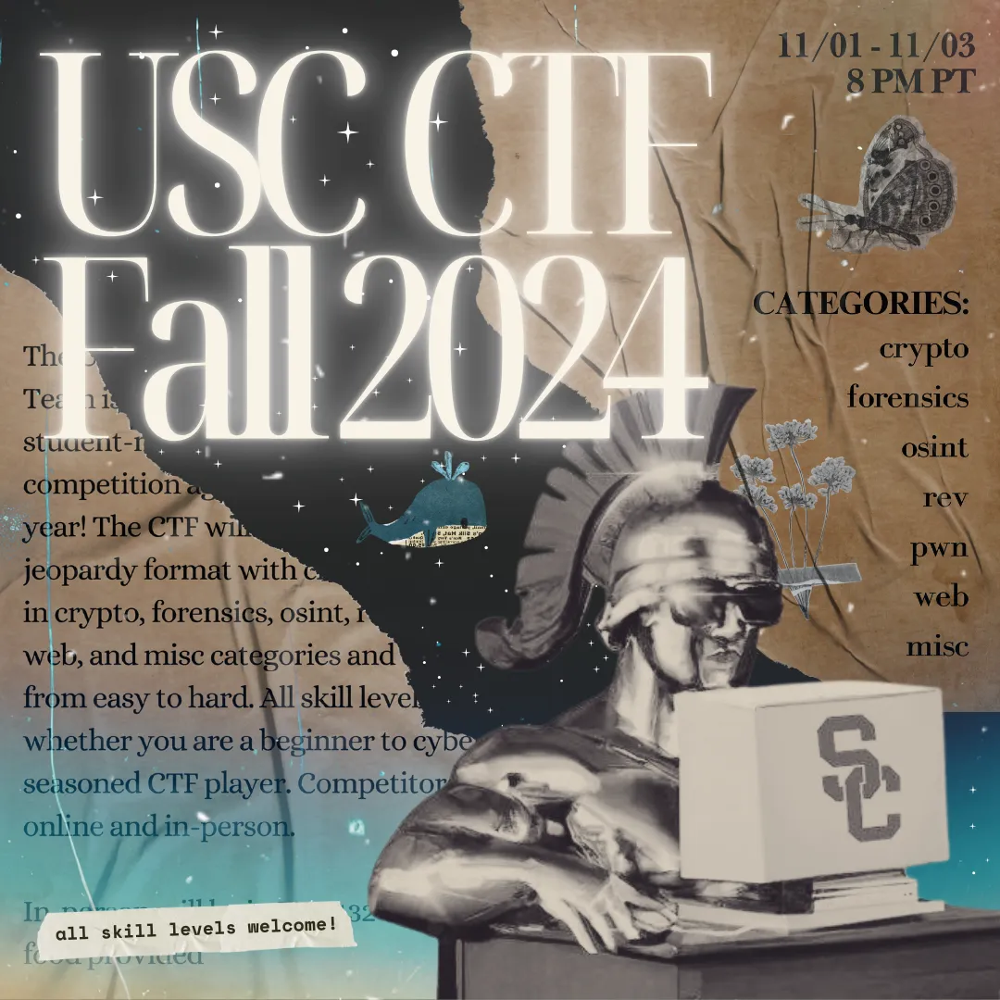
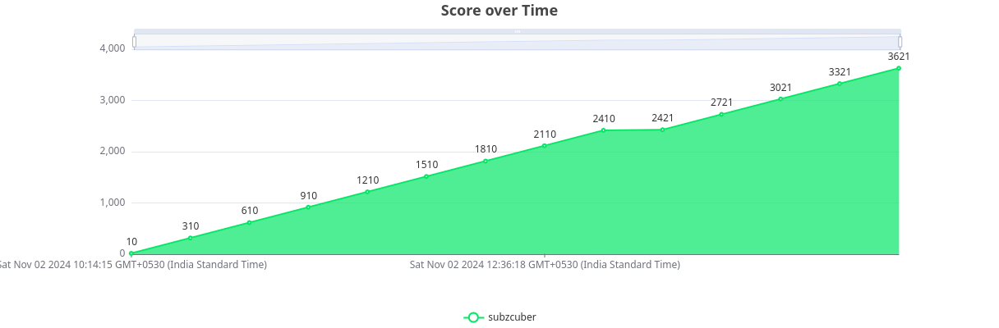

# USC CTF FALL 2024

I really enjoyed this CTF, mainly because it was relatively easy and I found there were a lot challenges that I could do.

I (`subzcuber`) placed 72/442 in the competitive bracket and 125/797 overall

I managed to clear `forensics` and `osint` along with the beginner ones and one `web` one.

Below is my score over time, not that it gives a lot of information

