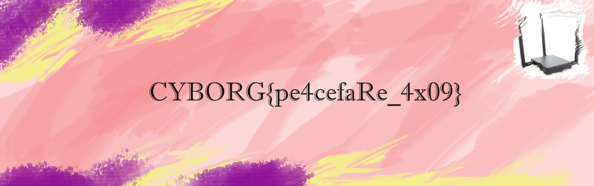

# pineapple

> Our covert pineapples intercepted this traffic from people at the convention. Try find out what was sent.

this was annoying, i got distracted a lot

first i noticed a lot of QUIC and TLS packets, and I went of on an annoying tangent to decrypt
QUIC packets, however that's not possible without the SSL key which we can't access

after a while I went back to the basics and searched for http packets, and managed to find a file
which can be extracted from wireshark using `File > Export Objects > HTTP`

the file was `plans.7z` which contained an image of the flag

however the archive is password protected, thankfully the password was in 
another http request

```
RT5'"FOE?f@@R6
8e4|^PNPOST / HTTP/1.1
Host: 192.168.56.101:5000
User-Agent: Mozilla/5.0 (X11; Linux x86_64; rv:91.0) Gecko/20100101 Firefox/91.0
Accept: text/html,application/xhtml+xml,application/xml;q=0.9,image/webp,*/*;q=0.8
Accept-Language: en-US,en;q=0.5
Accept-Encoding: gzip, deflate
Content-Type: application/x-www-form-urlencoded
Content-Length: 61
Origin: http://192.168.56.101:5000
Connection: keep-alive
Referer: http://192.168.56.101:5000/
Upgrade-Insecure-Requests: 1

username=jbarker&filename=hoolicon&filepw=conjoined_TRIANGLES
```

as we can see the password is `conjoined_TRIANGLES`



```
CYBORG{pe4cefaRe_4x09}
```

