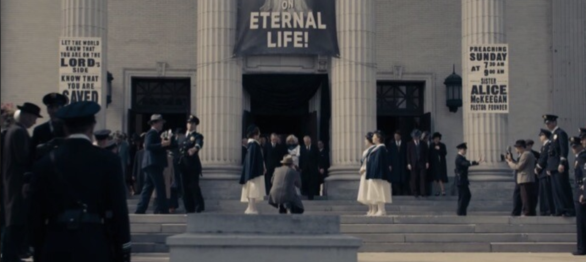

# television

> The attached image is from the TV series Perry Mason (2020-2023). Who was the (real-life) architect for the building in the background?
>
> Flag format: CYBORG{Firstname Lastname}
>
> Example: CYBORG{Carol Folt}

given image


quick reverse image search told me the building was used as the base for the "Radiant Assembly of God" in the show

[This](https://www.atlasofwonders.com/2020/06/perry-mason-city-filming-locations.html) link told me that
the "Second Church of Christ Scientist" was used for filming, and a quick wikipedia search told me the name of the architect

```
CYBORG{Alfred Rosenheim}
```
